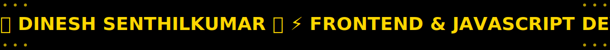

<!-- ═══════════════════════════════════════════════════════════════════════ -->
<!-- 🚍 LED BUS SIGN STYLE ANIMATED TYPING BOARD - TOP SECTION              -->
<!-- ═══════════════════════════════════════════════════════════════════════ -->

<!-- LED-Style Animated Bus Sign - Locally Hosted SVG -->

<!-- Optional: Animated LED Border Top -->

---

## 📌 **LED Bus Sign Animation - Customization Guide**

> **✨ The animated LED bus sign above is hosted directly in this repository!**
>
> **Location:** `assets/led-bus-sign.svg`
>
> ### 🎨 How to Customize:
> 
> 1. **Edit the text:** Open `assets/led-bus-sign.svg` and modify the text content inside the `<text>` tag
> 2. **Change colors:** 
>    - Text color: Change `fill: #FFD700;` (yellow)
>    - Background: Change `fill="#000000"` (black)
>    - Glow effect: Modify `text-shadow` values
> 3. **Adjust animation speed:** Change `animation: scroll-left 20s` (20 seconds)
> 4. **Font options:** Replace `'Orbitron'` with `'Share Tech Mono'` or `'Courier New'`
> 5. **Add more text:** Simply add content to the text string with emojis and symbols
>
> ### 🚀 Why Locally Hosted?
> - ✅ **Guaranteed rendering** across all browsers
> - ✅ **No external dependencies** - works offline
> - ✅ **Full control** over animation and styling
> - ✅ **Fast loading** - served directly from GitHub

---

<!-- Neon Rainbow Divider -->

<!-- Profile Card with Glow Effect -->

  

### **Hi — I'm Dinesh** 👋

**Frontend & JavaScript Developer**

🎯 Building modern, interactive web interfaces  
✨ Pixel-perfect UIs • Responsive layouts • JS-powered experiences

 

---

## 🎮 **Interactive Showcase**

### 🕹️ **Try My Mini-Game**

**[Stone-Paper-Scissors](https://dineshtm07.github.io/SIMPLE-GAME-SPS/)** — Click to play!

---

## 🚀 **Core Competencies**

---

## 🌱 **Expanding Expertise**

---

## 📊 **GitHub Stats**

<!-- Daily Inspirational Quote -->

---

## 📫 **Connect With Me**

### 💼 **Hire / Collaborate**

📧 **[duke02101@gmail.com](mailto:duke02101@gmail.com)**  
✅ *Open for freelance & front-end roles*

---

<!-- Wavy Footer Animation -->

### 💬 **Feedback & Suggestions**

[Submit Feedback](https://github.com/DINESHTM07/DINESHTM07/issues/new?template=feedback.md) • [Report Issue](https://github.com/DINESHTM07/DINESHTM07/issues)

<!-- Final Animated Border -->

---

### ⭐ **If you like my work, consider giving this profile a star!**

