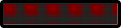

  

<!-- Neon Gradient Divider -->

-- 

  <strong>Hi — I’m Dinesh (Frontend & JavaScript Developer)</strong> 👋
   
  I design and build modern, interactive web interfaces — pixel-perfect UIs, clean responsive layouts and JavaScript-powered interactions. Always learning, always shipping.

---

  <!-- Fancy contribution animation (neon/retro) -->
  

---

## 🏆 Core Competencies

  
  
  
  
  
  
  

---

## 🌱 Expanding Expertise (Next in Progress ⚡)

  

---

🚀 <strong>First Step in DOM Manipulation & Interactive Web Projects</strong>
 
 Welcome to my <strong>frontend playground</strong>, where I transform ideas into interactive web experiences. This collection highlights <strong>my journey learning JavaScript, DOM manipulation, and UI/UX design</strong>, featuring projects that range from <strong>utility apps and games to personalized creative gifts</strong>. Each project reflects a hands-on approach to <strong>problem-solving, interactivity, and modern web practices</strong>. Dive in, explore live demos, and see how code comes to life! 
 
A selection of polished frontend experiments and interactive JS projects.
 <table align="center" style="border-collapse: collapse; width:100%;"> <thead> <tr style="background:#0d1117; color:#fff;"> <th style="padding:10px; border:1px solid #222;">#</th> <th style="padding:10px; border:1px solid #222;">Project</th> <th style="padding:10px; border:1px solid #222;">Tags</th> <th style="padding:10px; border:1px solid #222;">Stack</th> <th style="padding:10px; border:1px solid #222;">Live / Repo</th> </tr> </thead> <tbody> <tr> <td style="padding:10px; border:1px solid #222;">1</td> <td style="padding:10px; border:1px solid #222;"><strong>Simple Calculator</strong></td> <td style="padding:10px; border:1px solid #222;">    </td> <td style="padding:10px; border:1px solid #222;">    </td> <td style="padding:10px; border:1px solid #222;"> <a href="https://dineshtm07.github.io/SIMPLE-CALCULARTOR/">🌐 Live</a> | <a href="https://github.com/DINESHTM07/SIMPLE-CALCULARTOR">💻 Repo</a> </td> </tr> <tr> <td style="padding:10px; border:1px solid #222;">2</td> <td style="padding:10px; border:1px solid #222;"><strong>Random Quote Generator</strong></td> <td style="padding:10px; border:1px solid #222;">    </td> <td style="padding:10px; border:1px solid #222;">    </td> <td style="padding:10px; border:1px solid #222;"> <a href="https://dineshtm07.github.io/QUOTES-GENERATOR/">🌐 Live</a> | <a href="https://github.com/DINESHTM07/QUOTES-GENERATOR">💻 Repo</a> </td> </tr> <tr> <td style="padding:10px; border:1px solid #222;">3</td> <td style="padding:10px; border:1px solid #222;"><strong>String Playground</strong></td> <td style="padding:10px; border:1px solid #222;">    </td> <td style="padding:10px; border:1px solid #222;">    </td> <td style="padding:10px; border:1px solid #222;"> <a href="https://dineshtm07.github.io/STRING-PLAYGROUND/">🌐 Live</a> | <a href="https://github.com/DINESHTM07/STRING-PLAYGROUND">💻 Repo</a> </td> </tr> <tr> <td style="padding:10px; border:1px solid #222;">4</td> <td style="padding:10px; border:1px solid #222;"><strong>To-Do Manager</strong></td> <td style="padding:10px; border:1px solid #222;">    </td> <td style="padding:10px; border:1px solid #222;">    </td> <td style="padding:10px; border:1px solid #222;"> <a href="https://dineshtm07.github.io/TO-DO--MANAGER/">🌐 Live</a> | <a href="https://github.com/DINESHTM07/TO-DO--MANAGER">💻 Repo</a> </td> </tr> <tr> <td style="padding:10px; border:1px solid #222;">5</td> <td style="padding:10px; border:1px solid #222;"><strong>Weather App</strong></td> <td style="padding:10px; border:1px solid #222;">     </td> <td style="padding:10px; border:1px solid #222;">     </td> <td style="padding:10px; border:1px solid #222;"> <a href="https://dineshtm07.github.io/WEATHER-API-BASIC/">🌐 Live</a> | <a href="https://github.com/DINESHTM07/WEATHER-API-BASIC">💻 Repo</a> </td> </tr> <tr> <td style="padding:10px; border:1px solid #222;">6</td> <td style="padding:10px; border:1px solid #222;"><strong>Glassmorphism Calculator</strong></td> <td style="padding:10px; border:1px solid #222;">     </td> <td style="padding:10px; border:1px solid #222;">     </td> <td style="padding:10px; border:1px solid #222;"> <a href="https://dineshtm07.github.io/GLASSMORPHISM-CALCULATOR/">🌐 Live</a> | <a href="https://github.com/DINESHTM07/GLASSMORPHISM-CALCULATOR">💻 Repo</a> </td> </tr> <tr> <td style="padding:10px; border:1px solid #222;">7</td> <td style="padding:10px; border:1px solid #222;"><strong>Password Generator</strong></td> <td style="padding:10px; border:1px solid #222;">    </td> <td style="padding:10px; border:1px solid #222;">    </td> <td style="padding:10px; border:1px solid #222;"> <a href="https://dineshtm07.github.io/PASSWORD-GENERATOR-BASIC/">🌐 Live</a> | <a href="https://github.com/DINESHTM07/PASSWORD-GENERATOR-BASIC">💻 Repo</a> </td> </tr> <tr> <td style="padding:10px; border:1px solid #222;">8</td> <td style="padding:10px; border:1px solid #222;"><strong>Stone Paper Scissors Game</strong></td> <td style="padding:10px; border:1px solid #222;">     </td> <td style="padding:10px; border:1px solid #222;">     </td> <td style="padding:10px; border:1px solid #222;"> <a href="https://dineshtm07.github.io/SIMPLE-GAME-SPS/">🌐 Live</a> | <a href="https://github.com/DINESHTM07/SIMPLE-GAME-SPS">💻 Repo</a> </td> </tr> <tr> <td style="padding:10px; border:1px solid #222;">9</td> <td style="padding:10px; border:1px solid #222;"><strong>For Kulla — From Theodore</strong></td> <td style="padding:10px; border:1px solid #222;">      </td> <td style="padding:10px; border:1px solid #222;">      </td> <td style="padding:10px; border:1px solid #222;"> <a href="https://dineshtm07.github.io/FIRST-DOM-RandomQuoteGenerator/">🌐 Live</a> | <a href="https://github.com/DINESHTM07/FIRST-DOM-RandomQuoteGenerator">💻 Repo</a> </td> </tr> </tbody> </table> 

## ⚡ JavaScript Projects (Core JS work)

Practical JS: fundamentals, DOM manipulation, mini-apps & practice builds.

<table align="center" style="border-collapse: collapse; width:100%; font-family: 'Segoe UI', Tahoma, Geneva, Verdana, sans-serif;">
<thead>
<tr style="background: linear-gradient(90deg, #0d1117, #161b22); color:#fff; text-transform: uppercase;">
<th style="padding:12px; border:1px solid #222;">#</th>
<th style="padding:12px; border:1px solid #222;">Project</th>
<th style="padding:12px; border:1px solid #222;">Tags</th>
<th style="padding:12px; border:1px solid #222;">Stack</th>
<th style="padding:12px; border:1px solid #222;">Live / Repo</th>
</tr>
</thead>
<tbody>

<tr style="background:#111827; transition: all 0.3s;">
<td style="padding:10px; border:1px solid #222; text-align:center;">1</td>
<td style="padding:10px; border:1px solid #222;"><strong>JavaScript Mastery</strong></td>
<td style="padding:10px; border:1px solid #222;">

</td>
<td style="padding:10px; border:1px solid #222;">

</td>
<td style="padding:10px; border:1px solid #222;">
<a href="https://dineshtm07.github.io/javascript-mastery/" style="text-decoration:none;">🌐 Live</a> | 
<a href="https://github.com/DINESHTM07/javascript-mastery" style="text-decoration:none;">💻 Repo</a>
</td>
</tr>

<tr style="background:#1b1f28;">
<td style="padding:10px; border:1px solid #222; text-align:center;">2</td>
<td style="padding:10px; border:1px solid #222;"><strong>JS Practice Projects</strong></td>
<td style="padding:10px; border:1px solid #222;">

</td>
<td style="padding:10px; border:1px solid #222;">

</td>
<td style="padding:10px; border:1px solid #222;">
<a href="https://dineshtm07.github.io/JS-PRACTCE-PROJECTS/" style="text-decoration:none;">🌐 Live</a> | 
<a href="https://github.com/DINESHTM07/JS-PRACTCE-PROJECTS" style="text-decoration:none;">💻 Repo</a>
</td>
</tr>

</tbody>
</table>

## 👑 Projects — HTML & CSS

🚀 <strong>Frontend Projects Portfolio</strong>

Explore my <strong>modern, responsive, and interactive web projects</strong>. 
Built with HTML, CSS, Bootstrap, and Flexbox, these projects showcase my <strong>frontend skills, UI/UX design, and creative coding</strong>.

<table align="center" style="border-collapse: collapse; width:100%; font-family: 'Segoe UI', Tahoma, Geneva, Verdana, sans-serif;">
<thead>
<tr style="background: linear-gradient(90deg, #0d1117, #161b22); color:#fff; text-transform: uppercase;">
<th style="padding:12px; border:1px solid #222;">#</th>
<th style="padding:12px; border:1px solid #222;">Project</th>
<th style="padding:12px; border:1px solid #222;">Tags</th>
<th style="padding:12px; border:1px solid #222;">Stack</th>
<th style="padding:12px; border:1px solid #222;">Live / Repo</th>
</tr>
</thead>
<tbody>

<tr style="background:#111827; transition: all 0.3s;">
<td style="padding:10px; border:1px solid #222; text-align:center;">1</td>
<td style="padding:10px; border:1px solid #222;"><strong>Modern Furniture Store</strong></td>
<td style="padding:10px; border:1px solid #222;">

</td>
<td style="padding:10px; border:1px solid #222;">

</td>
<td style="padding:10px; border:1px solid #222;">
<a href="https://dineshtm07.github.io/BEG-FURNITURE-STORE/" style="text-decoration:none;">🌐 Live</a> | 
<a href="https://github.com/DINESHTM07/BEG-FURNITURE-STORE" style="text-decoration:none;">💻 Repo</a>
</td>
</tr>

<tr style="background:#1b1f28;">
<td style="padding:10px; border:1px solid #222; text-align:center;">2</td>
<td style="padding:10px; border:1px solid #222;"><strong>Luxury Portfolio</strong></td>
<td style="padding:10px; border:1px solid #222;">

</td>
<td style="padding:10px; border:1px solid #222;">

</td>
<td style="padding:10px; border:1px solid #222;">
<a href="https://dineshtm07.github.io/BEG-LUXURY-PORTFOLIO/" style="text-decoration:none;">🌐 Live</a> | 
<a href="https://github.com/DINESHTM07/BEG-LUXURY-PORTFOLIO" style="text-decoration:none;">💻 Repo</a>
</td>
</tr>

<tr style="background:#111827;">
<td style="padding:10px; border:1px solid #222; text-align:center;">3</td>
<td style="padding:10px; border:1px solid #222;"><strong>Shoes E-commerce</strong></td>
<td style="padding:10px; border:1px solid #222;">

</td>
<td style="padding:10px; border:1px solid #222;">

</td>
<td style="padding:10px; border:1px solid #222;">
<a href="https://dineshtm07.github.io/SHOES-E-COMMERCE-WEBSITE/" style="text-decoration:none;">🌐 Live</a> | 
<a href="https://github.com/DINESHTM07/SHOES-E-COMMERCE-WEBSITE" style="text-decoration:none;">💻 Repo</a>
</td>
</tr>

<tr style="background:#1b1f28;">
<td style="padding:10px; border:1px solid #222; text-align:center;">4</td>
<td style="padding:10px; border:1px solid #222;"><strong>Flexbox Landing Page</strong></td>
<td style="padding:10px; border:1px solid #222;">

</td>
<td style="padding:10px; border:1px solid #222;">

</td>
<td style="padding:10px; border:1px solid #222;">
<a href="https://dineshtm07.github.io/FLEXBOX-LANDING-PAGE/" style="text-decoration:none;">🌐 Live</a> | 
<a href="https://github.com/DINESHTM07/FLEXBOX-LANDING-PAGE" style="text-decoration:none;">💻 Repo</a>
</td>
</tr>

<tr style="background:#111827;">
<td style="padding:10px; border:1px solid #222; text-align:center;">5</td>
<td style="padding:10px; border:1px solid #222;"><strong>Admin Dashboard</strong></td>
<td style="padding:10px; border:1px solid #222;">

</td>
<td style="padding:10px; border:1px solid #222;">

</td>
<td style="padding:10px; border:1px solid #222;">
<a href="https://dineshtm07.github.io/ADMIN-DASHBOARD/" style="text-decoration:none;">🌐 Live</a> | 
<a href="https://github.com/DINESHTM07/ADMIN-DASHBOARD" style="text-decoration:none;">💻 Repo</a>
</td>
</tr>

<tr style="background:#1b1f28;">
<td style="padding:10px; border:1px solid #222; text-align:center;">6</td>
<td style="padding:10px; border:1px solid #222;"><strong>Beginner Portfolio</strong></td>
<td style="padding:10px; border:1px solid #222;">

</td>
<td style="padding:10px; border:1px solid #222;">

</td>
<td style="padding:10px; border:1px solid #222;">
<a href="https://dineshtm07.github.io/BEG-PORTFOLIO/" style="text-decoration:none;">🌐 Live</a> | 
<a href="https://github.com/DINESHTM07/BEG-PORTFOLIO" style="text-decoration:none;">💻 Repo</a>
</td>
</tr>

<tr style="background:#111827;">
<td style="padding:10px; border:1px solid #222; text-align:center;">7</td>
<td style="padding:10px; border:1px solid #222;"><strong>Candy Baby (Bootstrap)</strong></td>
<td style="padding:10px; border:1px solid #222;">

</td>
<td style="padding:10px; border:1px solid #222;">

</td>
<td style="padding:10px; border:1px solid #222;">
<a href="https://dineshtm07.github.io/CANDY-BABY-BS4/" style="text-decoration:none;">🌐 Live</a> | 
<a href="https://github.com/DINESHTM07/CANDY-BABY-BS4" style="text-decoration:none;">💻 Repo</a>
</td>
</tr>

</tbody>
</table>

---

## 📊 GitHub Stats & Activity

  
  

  

---

## 📫 Connect With Me

  
  
  

> **Hire / Collaborate:** [duke02101@gmail.com](mailto:duke02101@gmail.com) • Open for freelance & front-end roles
<!-- Wave footer (subtle) -->

  

  
  
  

    
  

  
  

    <em>Thanks for visiting! Have a great day! ✨</em>
  

  
  

  Built with ❤️ by DINESHTM07

